```mermaid
flowchart TD
    Start([Пользователь запускает: python -m src.cli.main chat -v]) --> Init[Инициализация агента]
    
    Init --> LoadConfig[Загрузка config/default.yaml]
    LoadConfig --> CreateLLM[Создание LLMClient]
    CreateLLM --> CreateIndexer[Создание CodeIndexer для embeddings]
    CreateIndexer --> RegisterTools[Регистрация инструментов в ToolRegistry]
    RegisterTools --> CreateOrch[Создание AgentOrchestrator]
    CreateOrch --> Ready([Агент готов к работе])
    
    Ready --> Input[Ожидание ввода пользователя]
    Input --> UserInput{Пользователь вводит сообщение}
    
    UserInput --> Process[AgentOrchestrator.process_user_request]
    
    Process --> CheckHistory{Первое сообщение?}
    CheckHistory -->|Да| AddSystem[Добавить системное сообщение в ConversationManager]
    CheckHistory -->|Нет| AddUser
    AddSystem --> AddUser[Добавить сообщение пользователя в историю]
    
    AddUser --> IterLoop[Цикл итераций: iteration = 0]
    
    IterLoop --> CheckMax{iteration < max_iterations?}
    CheckMax -->|Нет| MaxIterError[Возврат: 'Достигнут лимит итераций']
    CheckMax -->|Да| IncIter[iteration++]
    
    IncIter --> GetTools[Получить доступные инструменты]
    GetTools --> GetLocalTools[ToolRegistry.get_tools_as_dict]
    GetLocalTools --> GetMCPTools{Есть MCP клиент?}
    GetMCPTools -->|Да| ListMCPTools[MCPClient.list_tools]
    GetMCPTools -->|Нет| FormatTools
    ListMCPTools --> FormatTools[Форматирование инструментов для LLM]
    
    FormatTools --> GetMessages[ConversationManager.get_messages]
    GetMessages --> LLMRequest[LLMClient.chat: отправка запроса с историей и инструментами]
    
    LLMRequest --> LLMResponse[Получение ответа от LLM API]
    LLMResponse --> ParseResponse[Парсинг ответа: content, tool_calls]
    
    ParseResponse --> HasToolCalls{Есть tool_calls?}
    
    HasToolCalls -->|Да| ExecuteTools[Выполнение инструментов]
    HasToolCalls -->|Нет| FinalResponse[Финальный ответ от LLM]
    
    ExecuteTools --> AddAssistantMsg[Добавить ответ ассистента с tool_calls в историю]
    AddAssistantMsg --> LoopTools[Для каждого tool_call:]
    
    LoopTools --> CheckToolType{Локальный или MCP?}
    CheckToolType -->|Локальный| CallLocalTool[ToolRegistry.call_tool]
    CheckToolType -->|MCP| CallMCPTool[MCPClient.call_tool]
    
    CallLocalTool --> ExecuteTool[Выполнение инструмента.execute]
    CallMCPTool --> ExecuteTool
    ExecuteTool --> ToolResult[Получение результата]
    
    ToolResult --> AddToolMsg[Добавить tool message в историю]
    AddToolMsg --> MoreTools{Есть еще tool_calls?}
    MoreTools -->|Да| LoopTools
    MoreTools -->|Нет| ContinueLoop[Продолжить цикл итераций]
    
    ContinueLoop --> IterLoop
    
    FinalResponse --> AddFinalMsg[Добавить финальное сообщение ассистента]
    AddFinalMsg --> ReturnResponse[Вернуть content пользователю]
    MaxIterError --> ReturnResponse
    
    ReturnResponse --> Output[Вывод ответа: Агент: response]
    Output --> Input
    
    style Start fill:#e1f5ff
    style Ready fill:#e1f5ff
    style LLMRequest fill:#fff4e6
    style LLMResponse fill:#fff4e6
    style ExecuteTools fill:#e8f5e9
    style FinalResponse fill:#f3e5f5
    style ReturnResponse fill:#f3e5f5
```

Объяснение одного примера по шагам (логи + код):

**Шаг 1: Запуск команды (строка 43)**
- Пользователь запускает: `python -m src.cli.main chat -v`
- `src/cli/main.py`: команда `chat` вызывает `cmd_chat()` из `commands.py`

**Шаг 2: Инициализация (строки 44-62)**
- `init_agent()` в `commands.py`:
  - Загружается конфигурация из `config/default.yaml`
  - Создается `LLMClient` (модель: `openrouter/openai/gpt-oss-20b`)
  - Создается `CodeIndexer` для embeddings (используется `gp-embedding`)
  - Регистрируются инструменты в `ToolRegistry` (codebase_search, grep, write, read_file и т.д.)
  - Создается `AgentOrchestrator` с `max_iterations=20`

**Шаг 3: Цикл чата (строки 64-99)**
- Пользователь: "привет"
- `cmd_chat()` получает ввод и вызывает `agent.process_user_request("привет")`
- `AgentOrchestrator.process_user_request()`:
  - Добавляет системное сообщение (если история пуста)
  - Добавляет сообщение пользователя в `ConversationManager`
  - Цикл итераций:
    - Получает доступные инструменты (`_get_available_tools()`)
    - Отправляет запрос в LLM через `LLMClient.chat()` с историей и инструментами
    - LLM отвечает текстом (без вызовов инструментов)
    - Возвращает финальный ответ: "Привет! Как я могу помочь?"

**Шаг 4: Запрос с инструментом (строки 101-165)**
- Пользователь: "создай файл 123.txt"
- Итерация 1:
  - LLM получает запрос, решает использовать инструмент `write`
  - Возвращает `tool_calls` с вызовом `write(file_path="123.txt", contents="")`
- Итерация 2:
  - `AgentOrchestrator` выполняет `_execute_tool_call()`:
    - Парсит JSON аргументы
    - Вызывает `ToolRegistry.call_tool("write", {...})`
    - `WriteFileTool.execute()` создает файл `123.txt`
    - Результат: `{"status": "success", "file": "123.txt", "bytes_written": 0}`
  - Результат добавляется в историю как `tool` message
  - LLM получает результат и формирует финальный ответ: "Файл **123.txt** успешно создан..."

**Шаг 5: Простое сообщение (строки 167-206)**
- Пользователь: "спасибо"
- LLM отвечает текстом без инструментов
- Ответ: "Пожалуйста! Если понадобится что‑то ещё, дайте знать."

Финальный отчет только с диаграммой создан. Диаграмма показывает весь поток от запуска до завершения обработки запроса.